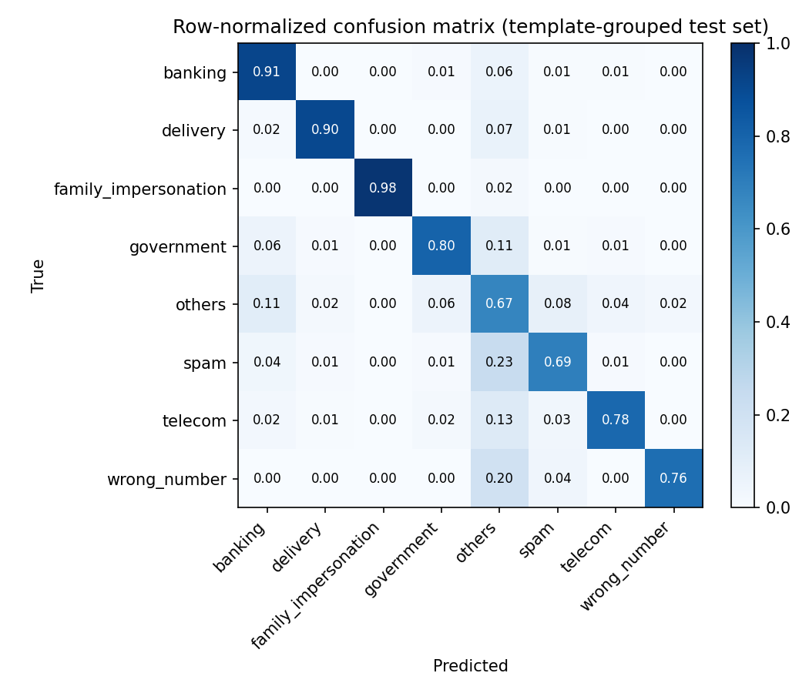

# Smishing Scam-Type Classifier

Classify SMS phishing messages into scam types (banking, delivery, government,
telecom, family impersonation, and more) across 50+ languages, with an
evaluation setup built to answer the question an operations team actually
asks: **how will this do on the next campaign it has never seen?**

Built on the public [IMC'25 labeled smishing dataset](https://github.com/reportsmishing/Smishing-Dataset-IMC25)
(33,788 messages, CC BY 4.0). This is an independent implementation on
public data; it contains no code or data from any employer.

## Key findings

**1. Row-level splits overstate performance.** Scammers resend the same
template thousands of times, so 45% of rows are near-duplicate copies of another
row. The same model scores **0.828** macro-F1 on a random row split but
**0.791** when whole templates are held out, which is the honest proxy for
new campaigns.

**2. Class weighting helps the rare, high-harm classes; hierarchy does not
pay for itself here.** A two-stage model that routes messages to
confusion-derived class groups matched but did not beat a single
class-balanced model, at 3x the training cost. I kept the simpler model.

| Model (template-grouped test set) | Macro-F1 (95% CI) | Macro-F1, one msg per template | Accuracy |
|---|---|---|---|
| Flat, unweighted | 0.781 (0.756–0.802) | 0.756 | 0.841 |
| **Flat, class-balanced** | **0.791 (0.766–0.811)** | 0.767 | 0.836 |
| Flat, class-balanced, ≤5 per template | 0.791 (0.765–0.812) | 0.769 | 0.839 |
| Hierarchical (learned groups), ≤5 per template | 0.786 (0.758–0.808) | 0.768 | 0.837 |

CIs are cluster bootstrap over templates (500 resamples).

**3. The `others` catch-all is the bottleneck.** Most errors flow into or out
of `others`; 31% of `spam` messages are predicted as `others`. Better label
definitions for that bucket would move the metric more than a bigger model.



**4. Confidence-based routing makes the model deployable today.**
Auto-labeling only predictions with confidence ≥ 0.8 handles 61% of traffic
at 96.8% accuracy and sends the rest to human review.

| Confidence threshold | Share auto-labeled | Accuracy | Macro-F1 |
|---|---|---|---|
| none | 100% | 0.836 | 0.791 |
| 0.7 | 70% | 0.945 | 0.900 |
| 0.8 | 61% | 0.968 | 0.927 |
| 0.9 | 49% | 0.986 | 0.958 |

**5. Non-English performance lags.** Macro-F1 is 0.805 in English and 0.777
in Spanish, but falls to 0.57–0.61 in French, German and Italian, where
training data is thin. Small-language slices are noisy, but the gap is large
enough to prioritize multilingual models or targeted labeling.

Full per-class and per-language tables: [reports/results.md](reports/results.md).

## Approach

```
raw SMS ─► normalize ─► MinHash LSH template clustering ─► template-grouped split
                                                              │
                          ┌───────────────────────────────────┤
                          ▼                                   ▼
          cap copies per template (train)        cluster-bootstrap evaluation
                          │                      per-class · per-language
                          ▼                      review-routing curve
     word + char TF-IDF ─► class-balanced logistic regression
                     (optional: confusion-grouped router + experts)
```

Design decisions, rejected alternatives and limitations are in
[docs/design.md](docs/design.md).

## Reproduce

```bash
make install   # pip install -e ".[dev]"
make data      # downloads the dataset at a pinned commit
make test
make run       # ~7 min on 2 CPUs; writes reports/
```

## Layout

```
src/scamtax/
  data.py       loading, label mapping, text normalization
  dedup.py      MinHash LSH near-duplicate (template) clustering
  split.py      row-level vs template-grouped splits
  models.py     TF-IDF pipeline, confusion-based grouping, hierarchical classifier
  evaluate.py   macro-F1, cluster bootstrap CI, slices, review routing
  run.py        end-to-end experiment and report generation
tests/          unit tests (run in CI)
configs/        experiment config
reports/        metrics.json, results.md, figures
```

## Next steps
- Multilingual transformer (XLM-R / mDeBERTa) fine-tuned on the same grouped
  split, to close the non-English gap.
- Re-define or split the `others` bucket with an LLM-assisted labeling pass
  and inter-annotator agreement checks.
- Temporal split to measure drift as campaigns change.

## Data attribution
Agarwal, Papasavva, Suarez-Tangil and Vasek. *Fishing for Smishing:
Understanding SMS Phishing Infrastructure and Strategies by Mining Public
User Reports.* ACM IMC 2025. https://doi.org/10.1145/3730567.3764431
(CC BY 4.0). The dataset is downloaded at runtime and not redistributed here.
